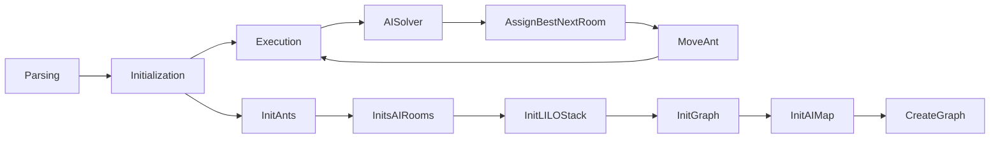
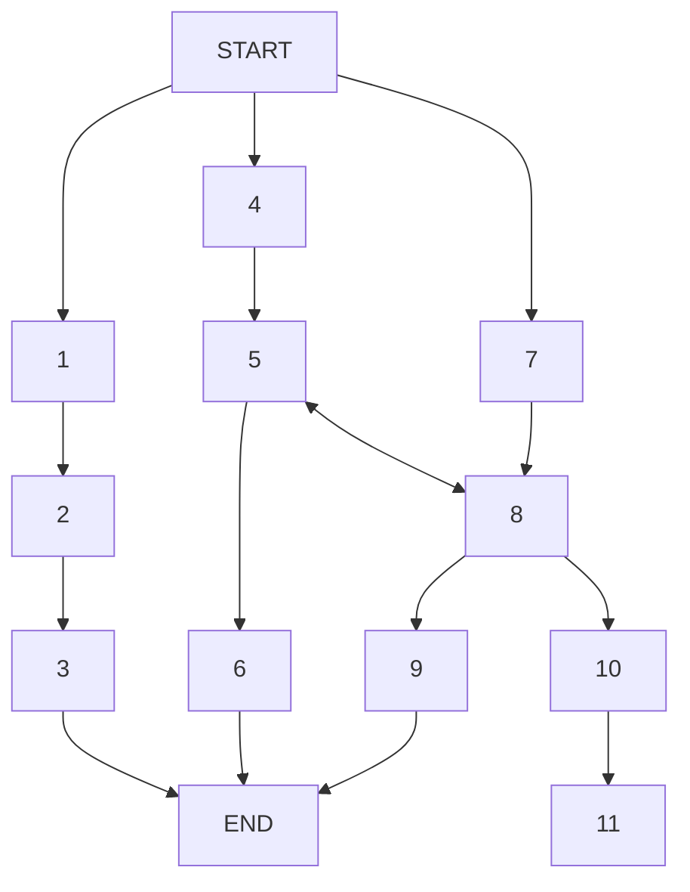
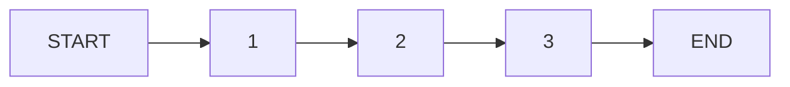
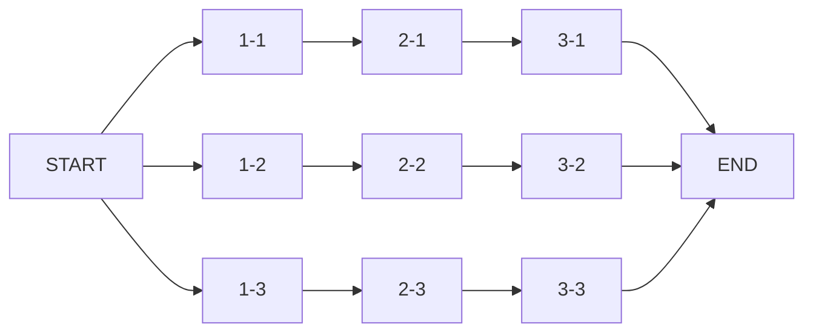

# Lem-in
Algorithm project using pathfinding. Recreate a HEX simulator. A ants colony must move to the end room.

## Usage

- Clone Repository
```bash
git clone https://github.com/vvaucoul/Lem-in && cd Lem-in
```

- Compilation
```bash
make
```

## Projet

The Lem-In project consists of a colony of ants moving from point A to point B. However, there are several constraints:
- Ants all start in the start room.
- Only one ant per room.
- Start room can send many ants as it want.
- End room can receive many ants as it wants.

## Algorithm

Several problems were encountered during the implementation of the project. Whether it is when creating paths, or loading time for large maps.<br>
At first, a simple recursive function adding the next room to the current path allowed me to get quite good results. <br>
But for much larger maps, the algorighme was far too long.<br>
So I decided to make a "Custom" algorithm to carry out this project.<br>

### Presentation

The entire algorithm goes through several phases.



- Parsing: This one will retrieve the map on the standard input and check if everything is correct, creditworthy and that there are no errors.
- The algorithm: It has several sub-parts:
  - Initialization of ants
  - AI room initialization
  - Initialization of a LILO stack (last in last out) containing the rooms visited and the next rooms to be discovered.
  - Initialization of the graph
  - Creation of the AI map
  - Creation of the graph

These last two parts are very important. <br>
- The first allows us to reconstruct the map with specialized structures for AI.

</img>
<br>

- Room Ref: containing the reference room. <br>
- Weight: The weight of the room (in relation to the distance from the start room)<br>
- Links: The links in the room (Parent room is removed)<br>

<br>
<br>
<br>

- The second part, allows to create the complete graph composed of these structures:

</img>
<br>

- A graph containing a linked list.
- A linked list containing a linked room list, path depth, next path and path ID.
- A linked list of rooms containing the reference room ID, its depth and the next room.

With these structures, we can recreate a possible path tree.
Then we prune the paths that do not reach the end room.
Then we get a complete graph!

<br>
<br>
<br>
<br>
<br>
<br>
<br>
<br>
<br>
<br>
<br>

Once the "Creation of map" part is finished, we move on to the "Solver" part.<br>
Each round, the Algorithm will determine the best path as well as the best room to choose for the next round.

To do this, I use several functions:
```C
static size_t __ek_path_get_depth(EkPath *path);
static size_t __ek_solver_path_get_nb_ants_in_path(EkPath *path, AiRoom *current_room);
static size_t __ek_solver_distance_from_start(EkPath *path, ANT *ant);
static size_t __ek_solver_ants_behind(EkPath *path);
```

Combined with a little Heuristic.
Then we get the next room where the ant can move.

### LILO Stack

This part is extremely important because by doing this. We can recreate the rooms not recursively but step by step.<br>
Allowing us to detect rooms already visited as well as those not to be checked.

> A standard lem-In Map.



<strong>Without LILO Stack</strong>



We notice that with the recursive function, the first path is done. However, it is impossible to check if another room has already been found with this.

<strong>With LILO Stack</strong>



All paths are done gradually not by path progression but by progression of rooms and links.<br>
All the rooms are visited and we can then determine if the next room **Depth** is less or equal to the current to not use it.

### Solver

We seek the shortest path however, if this path is already taken, then we choose the next best path if this one is as fast as the first. <br>
Sometimes it’s better to wait than send an ant down a long road.

Finaly, our program has been solved and all ants are in the end room with lowest possible turns.


