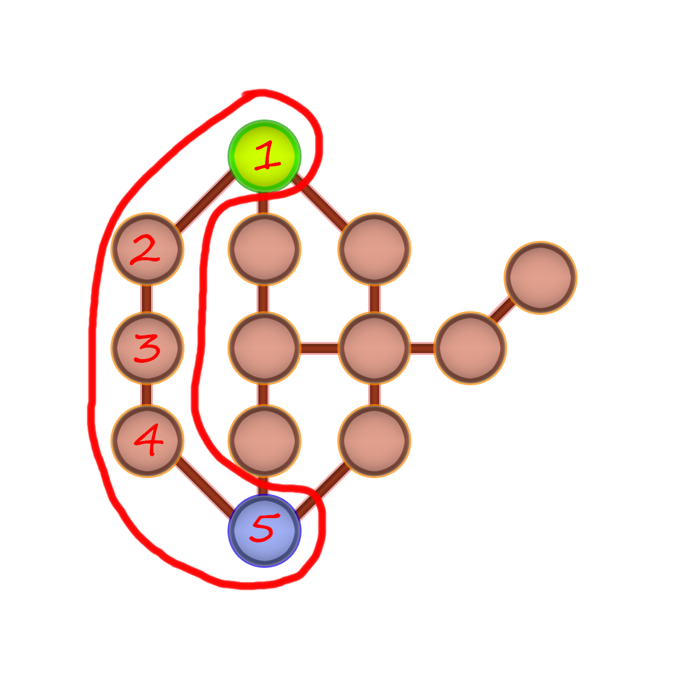
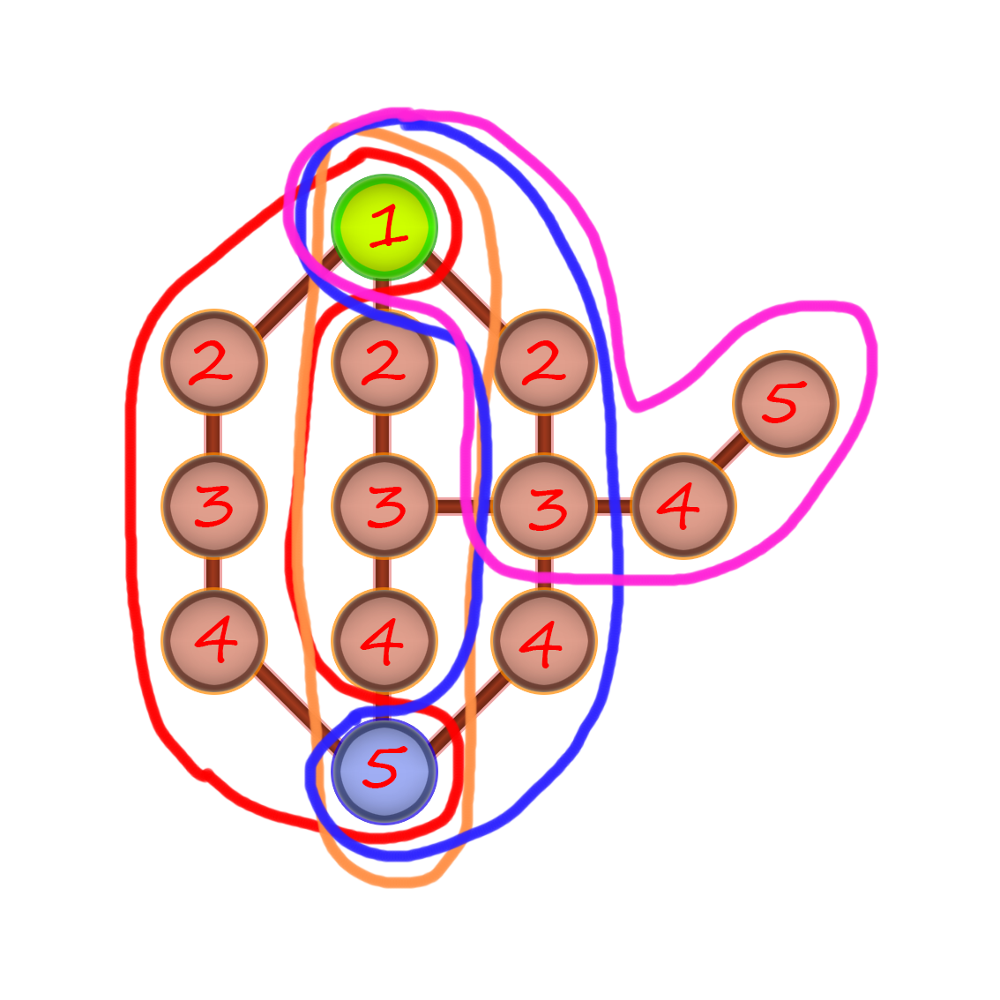

# Lem-in
Algorithm project using pathfinding. Recreate a HEX simulator. A ants colony must move to the end room.

- </img>
- </img>
- </img>

## Projet

Le projet Lem-In consiste à ce qu'une colonie de fourmis se déplace d'un point A à un point B. Il y a cependant plusieurs contraintes:
- Les fourmis commencent toutes à la salle de départ.
- Une seule fourmis par salle.
- La salle de départ peut envoyer autant de fourmis qu'elle veut
- La salle de fin peut recevoir autant de fourmis qu'elle veut

## Algorithme

Plusieurs problèmes ont étés rencontrés lors de la réalisation du projet. Que ce soit lors de la création des chemins, ou bien du temps pour les grandes map.
Au début, une simple fonction récursive ajoutant la prochaine salle au chemin actuel me permettait d'obtenir d'assez bon résultats. Mais pour les map bien plus grandes, l'algorighme était bien trop long.
J'ai donc décidé de réaliser un algorithme "Custom" pour mener à bien ce projet.

### Présentation

L'algorithme tout entier passe par plusieurs phases.

- Le parseur: Celui-ci va récupérer la map sur l'entrée standard et vérifier si tout est correcte, solvable et qu'il n'y ai pas d'erreurs.
- L'algorithme: Il possède plusieurs sous parties:
  - Initialisation des fourmis
  - Initialisation des salles AI
  - Initialisation d'une pile LILO (last in last out) contenant les salles visitées et les prochaines salles à découvrir.
  - Initialisation du graph
  - Création de la map AI
  - Création du graph

Ces deux dernières parties sont très importants.<br>
- La première, nous permet de reconstituer la map avec des structures spécialisées pour l'IA.

</img>
<br>

- Room Ref: contenant la salle de référence.<br>
- Weight: Le poids de la salle (par rapport à la distance de la salle du début)<br>
- Links: Les liens que contient la salle (La salle parent est supprimée)<br>

<br>
<br>
<br>

- La deuxième partie, permet de créer le graph complet composé de ces structures:

</img>
<br>

- Un graph contenant une liste chainée de path.
- Une liste chainée de path contenant une liste chainée de salles, la profondeur du path, le prochain path ainsi que l'ID du path.
- Une liste chainée de salles contenant l'ID de la salle de référence, sa profondeur ainsi que la prochaine salle.

Avec ces structures, on peut donc recréer un arbre de chemins possible.
Ensuite, on Prune les chemins qui n'atteignent pas la salle de fin.
On obtient alors un graph complet !

<br>
<br>
<br>
<br>
<br>
<br>
<br>
<br>
<br>
<br>
<br>

Une fois la partie "Création de map" terminée, on passe alors à la partie "Solver".
Chaque tours, l'Algorithme va déterminer le meilleur path ainsi que la meilleure salle à choisir pour le prochain tour.

Pour ce faire, j'utilises plusieurs fonctions:
```C
static size_t __ek_path_get_depth(EkPath *path);
static size_t __ek_solver_path_get_nb_ants_in_path(EkPath *path, AiRoom *current_room);
static size_t __ek_solver_distance_from_start(EkPath *path, ANT *ant);
static size_t __ek_solver_ants_behind(EkPath *path);
```

Combiné à un peu d'Heuristic.
On obtient alors la prochaine salle ou la fourmis peut se déplacer.

### Pile LILO

Cette partie est extrêmement importante puisqu'en faisant ça. On peut recréer les salles non pas en récursive mais étapes par étapes. Nous permettant de détecter les salles déjà visitées ainsi que celles à ne pas vérifier.

<strong>Sans pile LILO</strong>

</img>

On remarque bien qu'avec la fonction récursive, le premier chemin se fait d'un seul coup. Cependant, impossible de vérifier si une autre salle à déjà été trouvée avec cette technique.

<strong>Avec pile LILO</strong>

</img>

Tous les chemins s'effectuent progressivement non pas par progression de path mais par progression de salles et de liens. Toutes les salles sont donc visitées et on peut alors déterminer si la prochaine salle à un poids inférieure ou égale à la salle courrante pour ne pas la calculer.

### Solver

On cherche le chemin le plus court cependant, si ce chemin est déjà pris, on choisi alors le prochain meilleur chemin si celui-ci est aussi rapide que le premier. <br>
Des fois, il est préférable d'attendre plutôt que d'envoyer une fourmis dans un chemin trop long.


